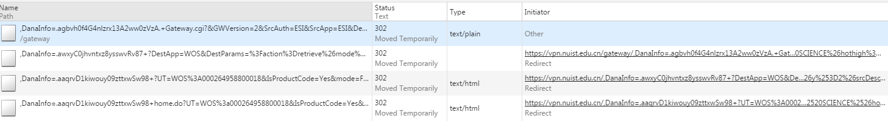

## 列表页
https://vpn.nuist.edu.cn/,DanaInfo=.aetkC0jhvntxz8ysswvRv87+paperpage.cgi
?option=G
&searchby=F
&search=COMPUTER+SCIENCE    //领域 `+`:`%20`
&hothigh=G
&option=G
&x=9
&y=10
&currpage=2 //page

## wos 页面
https://vpn.nuist.edu.cn/gateway/,DanaInfo=.agbvh0f4G4nlzrx13A2ww0zVzA.+Gateway.cgi?
&GWVersion=2
&SrcAuth=ESI
&SrcApp=ESI
&DestLinkType=FullRecord
&DestApp=WOS
&SrcAppSID=R2JXFFLY14ojtaGxywF
&SrcDesc=RETURN_ALT_TEXT
&SrcURL=http%3A//esi.webofknowledge.com/paperpage.cgi%3Foption%3DG%26option%3DG%26searchby%3DF%26search%3DCOMPUTER%2520SCIENCE%26hothigh%3DG%26x%3D9%26y%3D10%26currpage%3D1
&KeyUT=000251197700021  
**Accession Number(入藏号): WOS:000251197700021 唯一编号**
&SrcImageURL=


## Number of Citations (by year): 过去10年 该论文每年被引次数 不包含当年 不累计
https://vpn.nuist.edu.cn/,DanaInfo=.aetkC0jhvntxz8ysswvRv87+tabulargraphdata.cgi?
articleid=000251197700021       //wos_no
&search=COMPUTER%20SCIENCE
&from=paperpage
&name=COMPUTER%20SCIENCE
&hothigh=G&option=G
&searchby=F
&rankpage=
&currpage=1
&sortby=1
```
cookies = {
    "DSFirstAccess": "1453365010",
    "DSID": "8b38628dc581689e0b15aad0cd49c357",
    "DSLastAccess": "1453365298",
    "DSSignInURL": "/",
}
```

- [ ] 递归引用

cgi
表单提交
控制台看不到
fiddler也抓不到

- encoded：
tz_offset:480
username:20121344018
password:250036
realm:本专科生
btnSubmit:登陆

tz_offset=480&username=20121344018&password=250036&realm=%E6%9C%AC%E4%B8%93%E7%A7%91%E7%94%9F&btnSubmit=%E7%99%BB%E9%99%86


#  ESI 跳转 wos
三次重定向



C:\Windows\ProgramData\Oracle\Java\javapath;D:\Java\jdk1.7.0_80\jre\bin;D:\Java\jdk1.7.0_80\bin;%SystemRoot%\system32;%SystemRoot%;%SystemRoot%\System32\Wbem;%SYSTEMROOT%\System32\WindowsPowerShell\v1.0\;D:\TortoiseGit\bin;D:\nodejs\;D:\Anaconda2;D:\Anaconda2\Scripts;D:\Anaconda2\Library\bin

C:\Windows\ProgramData\Oracle\Java\javapath;D:\Java\jdk1.7.0_80\jre\bin;D:\Java\jdk1.7.0_80\bin;%SystemRoot%\system32;%SystemRoot%;%SystemRoot%\System32\Wbem;%SYSTEMROOT%\System32\WindowsPowerShell\v1.0\;D:\TortoiseGit\bin;D:\nodejs\;D:\Python27;D:\Python27\Scripts;D:\Python27\Library\bin

Python27

